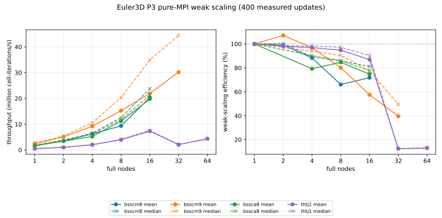

# Euler3D P3 full-node weak scaling

This report records pure-MPI weak scaling of `euler3D.exe` on four clusters.
Each MPI rank owns about 1024 periodic hexahedral cells and every allocation
uses all physical cores of every requested node. The source is `dev/harry`
commit `f6ece7e91e97c6337ef0761c30017b2ddad6b24b`.

The production case runs 500 steady internal updates at VFV `maxOrder=3` and
quadrature `intOrder=5`, with the limiter disabled. Updates 1--100 are warmup;
the statistics use all 400 timings from updates 101--500. Mean throughput
includes every observed stall. Median throughput describes the typical update,
and CV is timing standard deviation divided by mean timing. No timing samples
were trimmed.

| Cluster | Nodes | Ranks | N | Cells/rank | Mean MCell-it/s | Median MCell-it/s | Mean eff. | Median eff. | CV |
|---|---:|---:|---:|---:|---:|---:|---:|---:|---:|
| `bsscm8` | 1 | 192 | 58 | 1016.2 | 1.772 | 1.830 | 100.0% | 100.0% | 0.108 |
| `bsscm8` | 2 | 384 | 73 | 1013.1 | 3.504 | 3.672 | 98.9% | 100.3% | 0.150 |
| `bsscm8` | 4 | 768 | 92 | 1013.9 | 6.261 | 6.527 | 88.3% | 89.2% | 0.161 |
| `bsscm8` | 8 | 1536 | 116 | 1016.2 | 9.366 | 12.569 | 66.1% | 85.8% | 2.941 |
| `bsscm8` | 16 | 3072 | 147 | 1034.0 | 20.358 | 23.774 | 71.8% | 81.2% | 0.307 |
| `bsscm9` | 1 | 256 | 64 | 1024.0 | 2.382 | 2.808 | 100.0% | 100.0% | 1.599 |
| `bsscm9` | 2 | 512 | 81 | 1038.0 | 5.103 | 5.450 | 107.1% | 97.1% | 0.371 |
| `bsscm9` | 4 | 1024 | 102 | 1036.3 | 9.238 | 10.545 | 96.9% | 93.9% | 0.657 |
| `bsscm9` | 8 | 2048 | 128 | 1024.0 | 15.264 | 20.323 | 80.1% | 90.5% | 0.773 |
| `bsscm9` | 16 | 4096 | 161 | 1018.9 | 21.936 | 34.915 | 57.5% | 77.7% | 1.077 |
| `bsscm9` | 32 | 8192 | 203 | 1021.2 | 30.201 | 44.441 | 39.6% | 49.5% | 0.978 |
| `bssca8` | 1 | 128 | 51 | 1036.3 | 1.656 | 1.712 | 100.0% | 100.0% | 0.082 |
| `bssca8` | 4 | 512 | 81 | 1038.0 | 5.249 | 6.177 | 79.3% | 90.2% | 2.092 |
| `bssca8` | 8 | 1024 | 102 | 1036.3 | 11.211 | 11.790 | 84.6% | 86.1% | 0.171 |
| `bssca8` | 16 | 2048 | 128 | 1024.0 | 19.793 | 21.288 | 74.7% | 77.7% | 0.173 |
| `thtj1` | 1 | 56 | 39 | 1059.3 | 0.525 | 0.528 | 100.0% | 100.0% | 0.029 |
| `thtj1` | 2 | 112 | 49 | 1050.4 | 1.030 | 1.040 | 98.0% | 98.4% | 0.042 |
| `thtj1` | 4 | 224 | 61 | 1013.3 | 2.036 | 2.076 | 96.9% | 98.2% | 0.060 |
| `thtj1` | 8 | 448 | 77 | 1019.0 | 3.980 | 4.109 | 94.7% | 97.2% | 0.103 |
| `thtj1` | 16 | 896 | 97 | 1018.6 | 7.309 | 7.639 | 87.0% | 90.4% | 0.119 |
| `thtj1` | 32 | 1792 | 122 | 1013.3 | 2.101 | 2.109 | 12.5% | 12.5% | 0.011 |
| `thtj1` | 64 | 3584 | 154 | 1019.0 | 4.414 | 4.241 | 13.1% | 12.5% | 0.177 |

The accepted m9 run at 32 nodes and 8,192 ranks is direct evidence that there
is no universal failure threshold near 5,000 ranks. It completed with scheduler
exit `0:0` and delivered 30.20 mean and 44.44 median million cell-iterations/s.
Its declining mean efficiency and high CV show frequent long updates, while its
median still reaches 49.5% weak-scaling efficiency.

The live benchmark headers also record a material stack difference: m8 and a8
use Open MPI 4.1.0, while m9 uses Open MPI 4.1.8. CPU generation and network
fabric differ as well, so this correlation does not identify a single cause,
but it further supports treating the failure as cluster/runtime specific.

thtj1 has a different problem beginning at 32 nodes. Throughput falls from 7.31
million cell-iterations/s on 16 nodes to 2.10 million on 32 nodes. The 32-node
CV is only 0.011 and mean and median agree, so this is a stable scaling cliff
rather than a few timing outliers. The accepted 64-node member reaches 4.41
million mean and 4.24 million median cell-iterations/s, corresponding to 13.1%
and 12.5% weak-scaling efficiency. The 128-node member was attempted with both
two- and four-hour limits. Both attempts remained in
`ConvertAdjSerial2Global` until the scheduler limit and produced no iteration
samples, so there is no accepted 128-node throughput point.

The accepted 16-node points on m8 and a8 have mean efficiencies of 71.8% and
74.7%, and median efficiencies of 81.2% and 77.7%, respectively. Larger
canonical m8/a8 members have not produced accepted samples. m8 32-node attempts
and a8 24/32-node attempts either ended with signal-7-compatible accounting or
lost an allocated node. A 24-node m8 contiguous-pack diagnostic crossed the
redistribution boundary where the default transfer had failed, but later
reached its four-hour limit in face interpolation before entering the solver.

## Failure evidence

The repeatable m8 and a8 application/launcher failures have zero-byte stderr.
Their compact `sacct` status is `7:0`; the sites' JSON accounting and `seff`
decode return value 135, conventionally 128 plus signal 7. Slurm provides no
failed-node or system reason for these cases. Stdout localizes them to serial
mesh partitioning, serial-to-distributed transfer, or the silent setup after
`Done PartitionReorderToMeshCell2Cell`. Five m8 32-node attempts and one
24-node attempt ended this way, including runs with
`DNDS_DISABLE_ASYNC_MPI=1` and with UCX/OpenMPI error and backtrace settings.
The diagnostic settings emitted no backtrace, so the exact faulting process and
instruction remain unknown.

Accounting does not support ordinary node-memory exhaustion: the largest m8
batch-step RSS observed among these attempts was about 21 GiB, far below node
capacity. Core dumps were disabled by the site shell (`ulimit -c` was zero), so
there is no postmortem core image to recover from the completed jobs.

The source path at these markers uses `ArrayTransformer` and the default
`MPI_Type_create_hindexed` strategy. `DNDS_DISABLE_ASYNC_MPI` only lowers the
requested MPI thread level; it does not select another data-transfer path. An
a8 contiguous-pack diagnostic was attempted with
`DNDS_ARRAY_STRATEGY_USE_IN_SITU=1`, but an allocated node rebooted before the
transfer completed. The corresponding m8 diagnostic completed redistribution
at 4,608 ranks and entered `InterpolateFace`, unlike the default path, which
repeatedly exited by 1:05 at or before redistribution. It then timed out after
four hours. This strongly associates the early m8 exit with the hindexed
transfer path, but it does not identify the faulting MPI call or explain the
later setup scalability problem.

Infrastructure failures are recorded separately. Three a8 jobs were marked
`NODE_FAIL`; Slurm identified the affected nodes and now reports them down with
reason `Node unexpectedly rebooted`. The first thtj1 128-node attempt was
suspended during maintenance and stderr reported that ORTE lost a remote
daemon. A clean retry then reached the two-hour limit inside
`ConvertAdjSerial2Global` with empty stderr; a four-hour retry ended at the same
marker. The only stderr from the four-hour retry is Slurm's 102-byte time-limit
notice. These are timeouts, not captured application crashes. Exact job IDs,
phases, byte counts, and reasons are in
[`failed-attempts.csv`](results/failed-attempts.csv).

## Reproducibility

All builds have `DNDS_DIST_MT_USE_OMP=OFF`. Runtime values are
`DNDS_DIST_OMP_NUM_THREADS=1`, `OMP_NUM_THREADS=1`, one rank per physical core,
one CPU per rank, core binding, no oversubscription, and exclusive full-node
allocations. a8 and thtj1 request `MPI_THREAD_SERIALIZED`; m8 and m9 use the
default thread request for accepted production points.

Executable, config, mesh, source, scheduler, and runtime provenance is stored
per accepted record in [`results.json`](results/results.json). The shared config
SHA-256 is
`5ebbd6951692cfbeaad695911269f6e1029196c6da2fee81296e8be2f2f4ec11`.
[`results.csv`](results/results.csv) is the compact timing table and
[`jobs.csv`](results/jobs.csv) contains accepted scheduler records. Raw solver
logs and output directories remain in private cluster run records; tracked log
references are sanitized relative paths.
